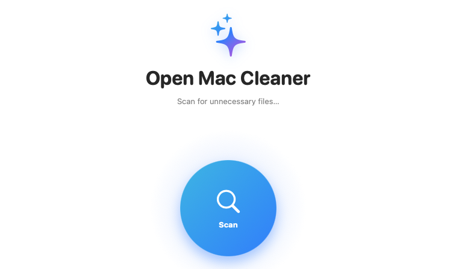
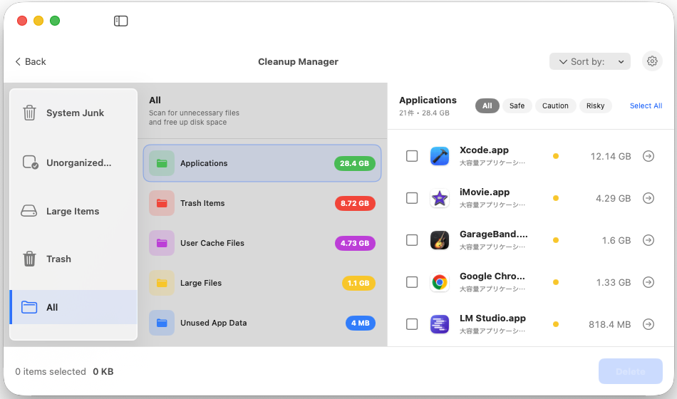

# OpenMacCleaner


> [!NOTE]
> This product was created using **Antigravity** (Generative AI).

> [!CAUTION]
> **Use at your own risk.**
> This application performs file deletion operations based on user actions. While safety measures are in place, the developers are not responsible for any data loss or system issues that may occur. Please verify important files before deletion.

**[🇯🇵 日本語のREADMEはこちら (Japanese README)](README_ja.md)**

OpenMacCleaner is an open-source system cleaning utility for macOS, designed to help you free up disk space by removing unnecessary files.

## Overview

 

*(Screen images are for illustrative purposes)*

OpenMacCleaner scans your system for various types of junk files, including application caches, logs, and unused developer data. It provides a clean, native macOS interface to review and delete these items safely.

## Features

- **System Scan**: Quickly identifies safe-to-delete files.
    - User Caches
    - Log Files
    - Xcode Derived Data (Developer Junk)
    - Unused Application Data
- **Safety First**: Clearly labels items as "Safe", "Caution", or "Risky" to prevent accidental deletion of critical system files.
- **Large File Finder**: Locates files larger than 100MB in your Home and Applications directories.
- **Modern UI**: Built with 100% SwiftUI, supporting both Light and Dark modes.
- **CLI (Experimental)**: An experimental command-line interface for system diagnosis and scanning.

## Requirements

- macOS 13.0 (Ventura) or later
- Xcode 15+ (for building)

## Installation

Download the latest version from the [Releases page](https://github.com/n-guitar/OpenMacCleaner/releases).

1. Unzip `OpenMacCleaner.zip`.
2. Move `OpenMacCleaner.app` to your Applications folder.
3. Open the app (you may need to right-click and select "Open" effectively bypassing Gatekeeper if not notarized).

## Build & Run (for Developers)

1. Clone the repository.
   ```bash
   git clone https://github.com/n-guitar/OpenMacCleaner.git
   cd OpenMacCleaner
   ```

2. Open the project in Xcode.
   ```bash
   open OpenMacCleanerApp/OpenMacCleanerApp.xcodeproj
   ```

3. Build and Run (Cmd+R).

## License

MIT License
